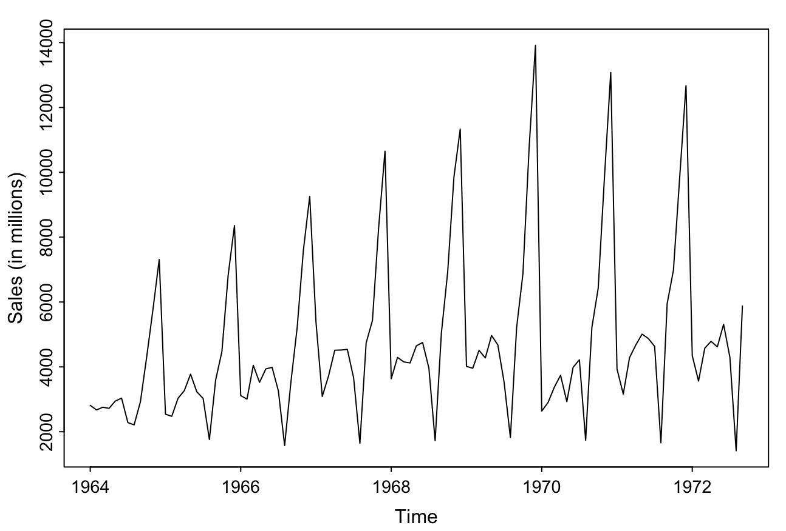
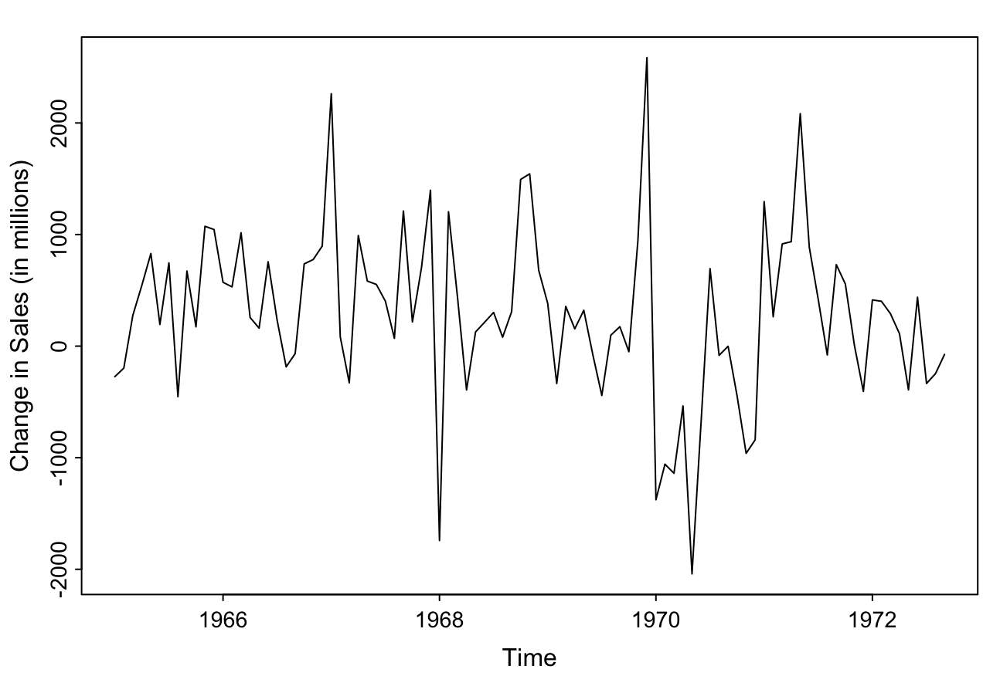
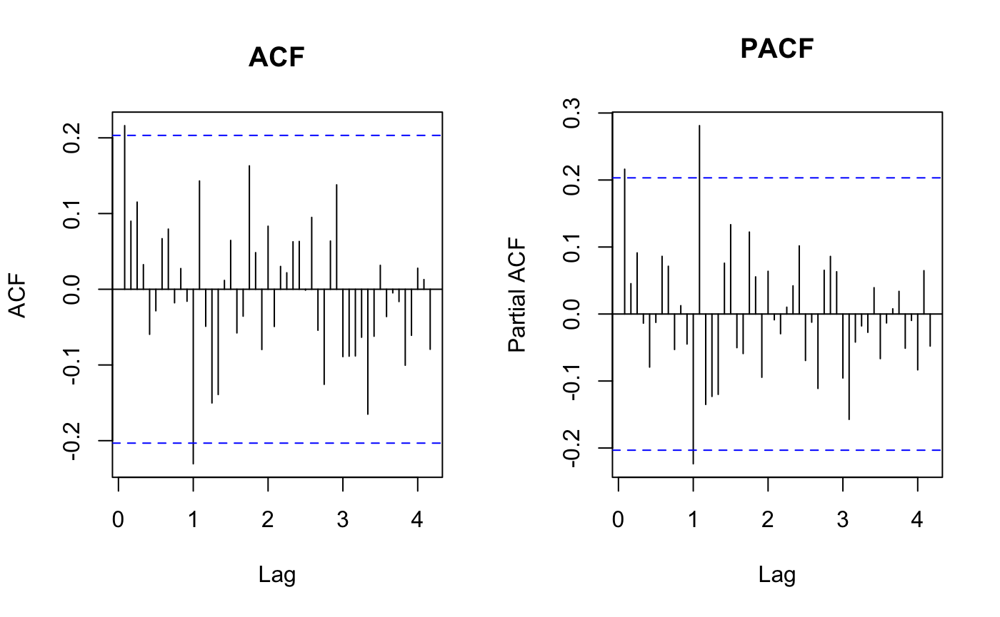
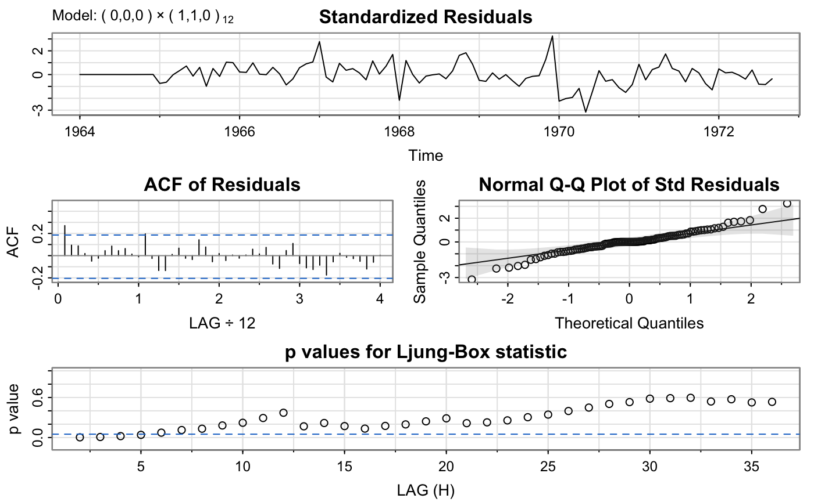
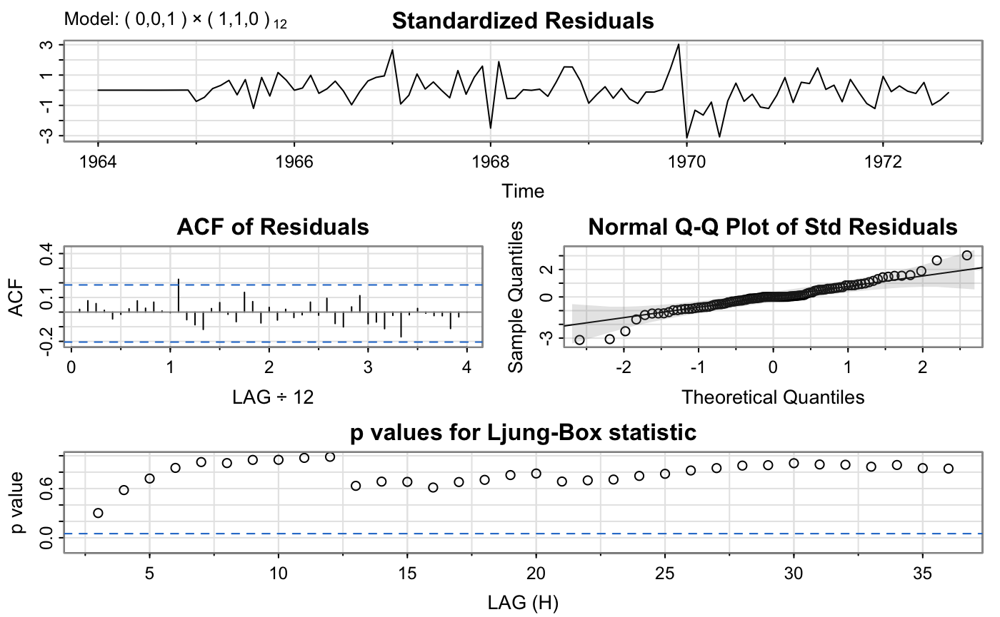
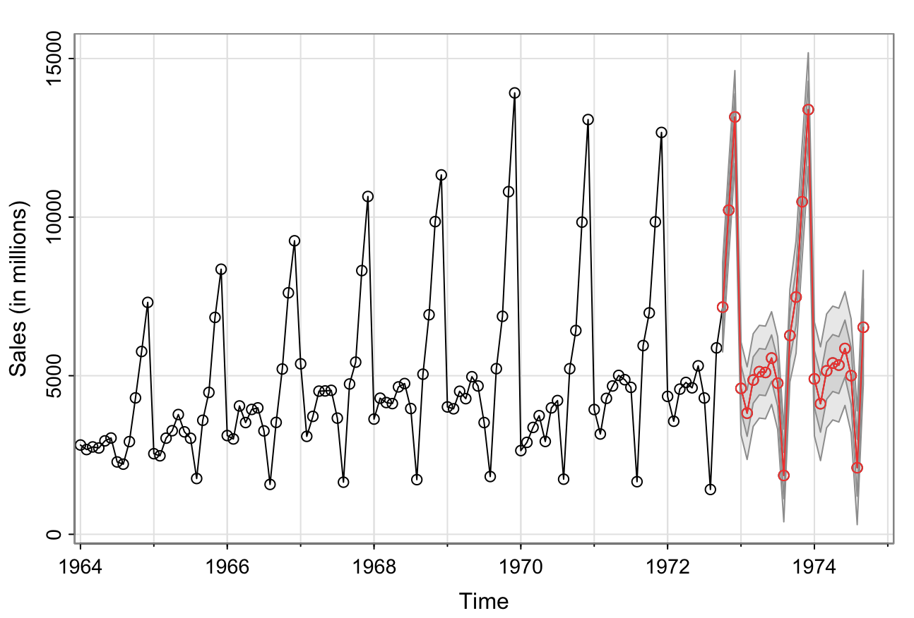

# Time Series Analysis of Monthly Champagne Sales

## Introduction

The purpose of this project is to apply the time series analysis methods learned in STATS 4A03 to model and forecast monthly Champagne sales for the Perrin Freres label in France. The dataset, originally credited to Makridakis and Wheelwright (1989), provides monthly observations of Champagne sales from January 1964 through September 1972, yielding a total of 105 data points. Each observation represents sales in millions.

Understanding historical sales behavior is vital in the wine and spirits industry, where factors such as seasonal festivities, marketing campaigns, consumer preferences, and broader economic influences can all affect demand. By identifying these patterns in the data, producers and distributors can plan more effectively for inventory, resource allocation, and strategic marketing. Such data-driven decision making helps optimize profits and reduce waste by aligning production with actual demand.

The goal of this project is to develop a suitable time series model that can produce accurate forecasts and capture the underlying demand structure. A forecast will enable stakeholders to anticipate peaks and troughs more confidently, supporting better-informed decisions in production scheduling, budgeting, and promotional planning. Through model selection, parameter estimation, diagnostic checks, and subsequent forecast generation, the project demonstrates how time series methods can uncover meaningful patterns in historical data and translate them into actionable business strategies.

## Modeling

### Initial Analysis

The time series plot of monthly Champagne sales from 1964 to 1972 shows a strong and repeating seasonal pattern, with sharp peaks occurring approximately every 12 months. In addition to the seasonality, there is a slight upward linear trend in overall sales over time. When both trend and seasonality are present, it is appropriate to first apply a seasonal difference (with lag 12 for monthly data) to remove the seasonal component. After this transformation, we can re-evaluate the series to determine whether a first (non-seasonal) difference is also needed to address the remaining trend and achieve stationarity.

### Differencing

After applying a seasonal difference of lag 12 to the monthly Champagne sales data, the resulting time series shows that the seasonality has been effectively removed. The sharp, repeating annual spikes present in the original series are no longer visible. Additionally, the slight upward linear trend observed earlier is no longer apparent in the seasonally differenced series, suggesting that the data may now be sufficiently stationary.

While we could consider applying a first (non-seasonal) difference to further eliminate any potential remaining trend, doing so would increase the complexity of the model. To keep the model as simple as possible, and since no strong trend remains visually or structurally, we proceed using only the seasonally differenced data for further modeling and analysis.

### Starionarity Testing: Dickey-Fuller Test

To statistically confirm whether the seasonally differenced series is stationary, we apply the Dickey-Fuller test. This test evaluates the null hypothesis that the time series contains a unit root (i.e., it is non-stationary), against the alternative hypothesis that the series is stationary. In this case, the test yields a Dickey-Fuller statistic of −4.0804 with a p-value of 0.01. Since the p-value is less than the 0.05 significance level, we reject the null hypothesis and conclude that the seasonally differenced series is stationary. This confirms that no additional differencing is needed, and the series is ready for model identification and fitting.

### ACF and PACF Analysis

From the ACF of the seasonally differenced series, we observe:

- A slight spike at lag 1, potentially indicating a non-seasonal MA(1) component.
- A slight spike around lag 12, which could suggest a seasonal MA(1) term.

However, neither spike appears strongly significant (they do not clearly rise above the dashed confidence bounds). To keep the model simple, we tentatively choose no non-seasonal MA and no seasonal MA at this stage. We will revisit this assumption later by testing a more complex model to confirm whether these components might improve the fit.

From the PACF of the seasonally differenced series, we observe:

- A small spike at lag 1, which may indicate a non-seasonal AR(1) component, but it is only marginally above the confidence band, so we treat it as insignificant for now.
- A significant spike around lag 12–13, suggesting the presence of a seasonal AR(1) term.

Because this spike is clearly above the confidence interval, we decide to include seasonal AR(1) in our tentative model specification.

Based on this initial inspection, we tentatively specify a model with ARIMA(0, 0, 0) × (1, 1, 0)12. We will compare this simpler specification with alternative models (for example, adding non-seasonal MA(1), seasonal MA(1), or non-seasonal AR(1)) to ensure that our final choice captures the underlying data patterns effectively.

### Model Fitting and Residual Analysis

#### Model 1: ARIMA(0,0,0) × (1,1,0)12

Model 1 Equation: Yₜ = 0.0985 + 24.2475Yₜ₋₁₂ + εₜ.

- **Standardized Residuals:** The residual plot shows no obvious patterns or trends, suggesting that the residuals behave like white noise.
- **ACF of Residuals:** Aside from a slight spike at one early lag, most autocorrelations lie well within the confidence bounds, indicating that the residuals are largely uncorrelated.
- **Normal Q-Q Plot:** The points broadly follow the straight line (except for some deviation at the tails), which is reasonably consistent with a normal distribution.
- **Ljung-Box Test:** Except for a few early lags, the p-values exceed 0.05, implying no significant autocorrelation is left in the residuals. However, the few lower p-values may suggest that incorporating an additional term could further improve the model fit.

Overall, the residual analysis supports the adequacy of the current model’s assumptions, but there may be room for minor refinements. We next consider adding a non-seasonal MA component.

#### Model 2: ARIMA(0,0,1) × (1,1,0)12

Model 2 Equation: Yₜ = 6.1473 + 0.8982Yₜ₋₁₂ + εₜ + 0.2590 εₜ₋₁.

- **Standardized Residuals:** There are no obvious patterns or trends, suggesting the residuals resemble white noise.
- **ACF of Residuals:** Apart from a minor spike around lag 12, all autocorrelations lie well within the confidence bounds, indicating little to no autocorrelation.
- **Normal Q-Q Plot:** The points mostly follow the straight line, with only slight deviation at the tails, supporting the assumption of normality.
- **Ljung-Box Test:** The p-values are consistently above 0.05, indicating no significant autocorrelation remains.

Given these results, the residuals appear to satisfy the key assumptions. Therefore, we tentatively accept this model specification.

## Results

### Effectiveness of the Forecast

The forecast extends the series from October 1972 to September 1974, showing a clear seasonal pattern with predictable peaks every 12 months (December) and troughs in early spring and late summer. The widening confidence intervals reflect increased uncertainty but remain reasonable, providing decision-makers with a practical range of expectations.

### Contribution to the Project Goal

The forecast allows producers and inventory managers to plan proactively for high-demand periods (e.g., December) and adjust for low-demand periods (e.g., January). From a marketing perspective, promotional efforts can be strategically timed to maximize impact. The model thus supports data-driven planning and reduces reliance on intuition.

## Conclusion

While the final ARIMA(0,0,1) × (1,1,0)12 model effectively captures the strong seasonal pattern, incorporating future data would help maintain alignment with evolving trends. Nevertheless, the model provides valuable insights for inventory, production, and marketing strategies. Periodic updates can ensure it remains an effective decision support tool in the Champagne industry.

## References

1. Dataset credited to Makridakis and Wheelwright (1989), available on Kaggle: [Monthly Sales Dataset of French Champagne](https://www.kaggle.com/datasets/piyushagni5/monthly-sales-of-french-champagne/data)
